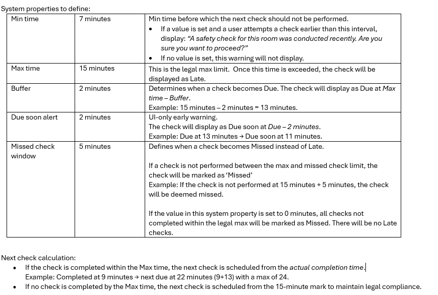

# PRD-001: Identity & Navigation Overhaul

## Overview

Rebrand the application from "eProbation" to "Safeguard," simplify the header to a single-row layout, and add immediate user identity feedback via an Avatar component.

## Goals

1. **Maximize screen real estate** for the checklist by moving to a single-row header.
2. **Provide user identity** via a new Avatar component with tooltip.
3. **Consistent branding** across Login and Side Menu.
4. **Improve discoverability** with tooltips on status counters.

---

## UX/UI Specification

### Header Layout (Single Row)

```
+---------------------------------------------------------------+
| [Menu]      [ Late: 1 | Due: 3 ]                   ( JD )     |
+---------------------------------------------------------------+
```

| Element | Position | Size | Notes |
|---------|----------|------|-------|
| Menu Button | Left | 40×40 | Existing |
| Status Bar | Center (flex) | Auto | Late + Due pills with tooltips |
| User Avatar | Right | 40×40 | Initials + tooltip |

### User Avatar

- **Size**: 40×40 circle
- **Background**: `var(--surface-bg-primary-solid)`
- **Text**: White, semibold, 1rem
- **Tooltip**: Full name (e.g., "Jane Doe") on tap/hover

### Status Bar Tooltips

Each counter pill displays a multi-line tooltip on tap:

**Late pill tooltip:**
```
Late: Checks past their 15-minute max window
```

**Due pill tooltip:**
```
Due now: Checks within the deadline window
Due soon: Approaching within 2 minutes
```

### Branding

| Location | Current | New |
|----------|---------|-----|
| Login Screen | "eProbation Mobile" | "Safeguard Mobile" |
| Side Menu Header | "eProbation" | "Safeguard" |

---

## Deprecations

| Component | Action |
|-----------|--------|
| `ViewModeSwitcher` | Delete (Route view no longer needed) |
| Manual Check "+" button | Hide (preserve code for future FAB) |

---

## File Manifest

| File | Action |
|------|--------|
| `src/data/atoms.ts` | Remove `dashboardRoute` from `AppView` |
| `src/data/useUrlSync.ts` | Update type guard |
| `src/components/UserAvatar.tsx` | **NEW** |
| `src/components/UserAvatar.module.css` | **NEW** |
| `src/features/Shell/StatusBar.tsx` | Add tooltips |
| `src/features/Shell/AppHeader.tsx` | Single-row layout |
| `src/features/Shell/AppHeader.module.css` | Update styling |
| `src/features/Shell/ViewModeSwitcher.tsx` | **DELETE** |
| `src/features/Shell/ViewModeSwitcher.module.css` | **DELETE** |
| `src/features/Session/LoginView.tsx` | Update branding |
| `src/features/Shell/AppSideMenu.tsx` | Update branding |
| `src/layouts/MainLayout.tsx` | Remove Route panel |
| `src/AppShell.tsx` | Remove Route references |
| `src/features/Workflow/ScanView.tsx` | Simplify to time-only |
| `src/features/Shell/AppFooter.tsx` | Simplify to time-only |

---

## Definition of Done

- [ ] Login screen displays "Safeguard Mobile"
- [ ] Side menu header displays "Safeguard"
- [ ] Header is a single row: `[Menu] [StatusBar] [Avatar]`
- [ ] Time/Route toggle is removed
- [ ] Avatar shows "JD" with tooltip "Jane Doe"
- [ ] Late pill tooltip shows explanation
- [ ] Due pill tooltip shows "Due now" and "Due soon" on separate lines
- [ ] Manual Check "+" button is hidden
- [ ] `npm run lint` passes
- [ ] `npm run build` succeeds

---

## Reference

> [!NOTE]
> The timing system properties (Min time, Max time, Buffer, etc.) are out of scope for this PRD. A separate PRD will address the check lifecycle logic.


