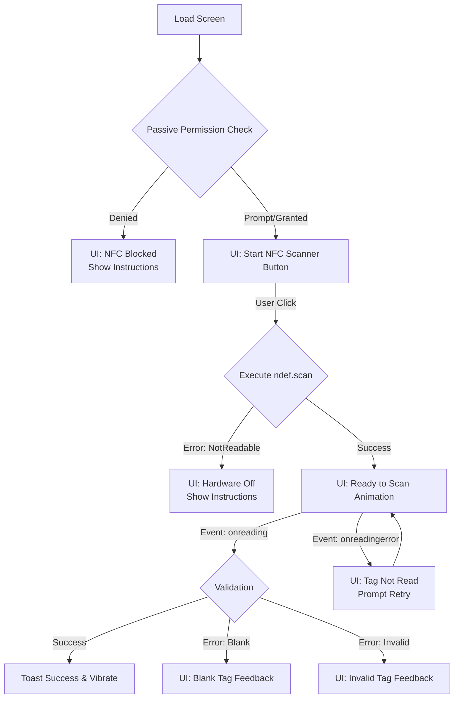

# NFC Activation Flow

```mermaid
graph TD
    A[Load Screen] --> B{Passive Permission Check}
    B -- Denied --> C[UI: NFC Blocked\nShow Instructions]
    B -- Prompt/Granted --> D[UI: Start NFC Scanner Button]
    
    D -- User Click --> E{Execute ndef.scan}
    
    E -- Error: NotReadable --> F[UI: Hardware Off\nShow Instructions]
    E -- Success --> G[UI: Ready to Scan Animation]
    
    G -- Event: onreading --> H{Validation}
    G -- Event: onreadingerror --> I[UI: Tag Not Read\nPrompt Retry]
    
    H -- Success --> J[Toast Success & Vibrate]
    H -- Error: Blank --> K[UI: Blank Tag Feedback]
    H -- Error: Invalid --> L[UI: Invalid Tag Feedback]
    
    I --> G
```
