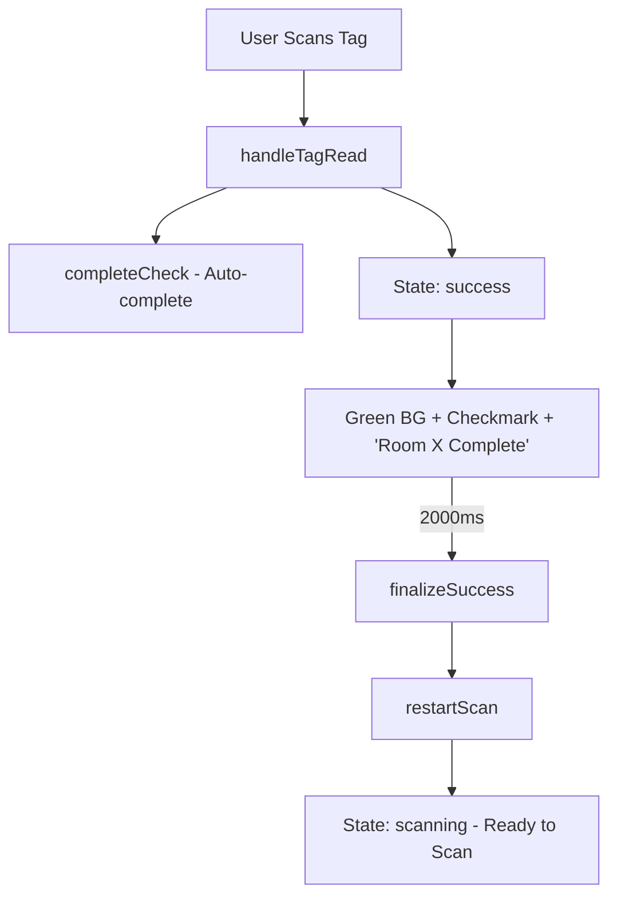
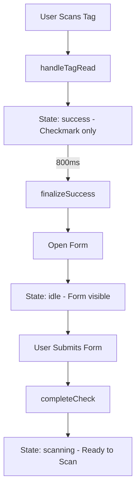
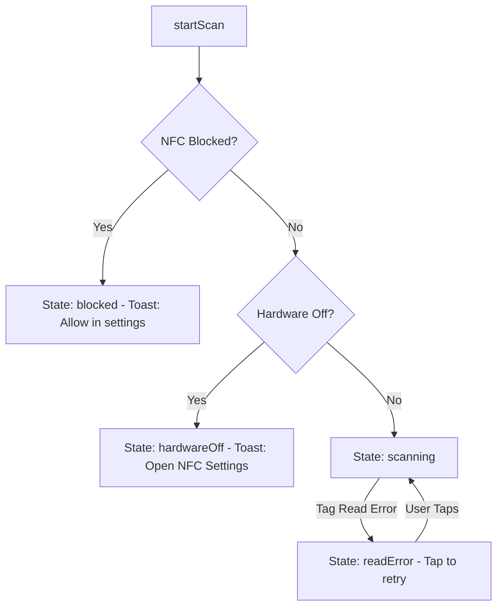

# NFC Scan Flow Specification

This document defines the complete NFC scan state machine for both Simple Scan modes.

---

## Setting Definition

| Setting | `simpleSubmitEnabled` | Meaning |
|:--------|:----------------------|:--------|
| **Simple Scan ON** | `true` | Auto-complete check, skip form |
| **Simple Scan OFF** | `false` | Show form for manual entry (default) |

---

## Flow A: Simple Scan ON (Auto-Complete Mode)

**Key Points:**
- `completeCheck()` IS called in `handleTagRead`
- `formComplete` state is NOT used
- `success` state shows checkmark AND text
- Total display time: 2000ms
- Ends with: `restartScan()` → "Ready to Scan"

---

## Flow B: Simple Scan OFF (Form Mode)

**Key Points:**
- `completeCheck()` is NOT called in `handleTagRead`
- `success` state shows checkmark only (NO text)
- Total checkmark display time: 800ms
- Form opens, user submits
- **NO "Room X Complete" feedback** after form submit
- Ends with: `setScanState('scanning')` → "Ready to Scan"

---

## Error States

---

## Key Files

- **`useNfcScan.ts`**: State machine logic, `handleTagRead`, `finalizeSuccess`, `restartScan`
- **`NfcScanButton.tsx`**: Visual rendering, timers, `isPreFormPhase` logic
- **`useCompleteCheck.ts`**: Dispatches check completion, sets post-form state

---

## Critical Variables

| Variable | Definition | Usage |
|:---------|:-----------|:------|
| `simpleSubmitEnabled` | App config setting | Determines auto-complete vs form mode |
| `isPreFormPhase` | `!simpleSubmitEnabled` | Controls timer duration and text visibility |
| `scanState` | NFC state atom | Drives UI rendering |
